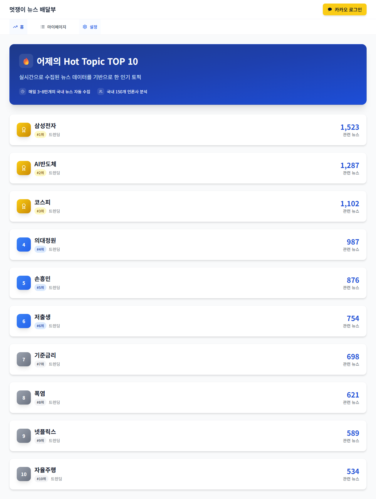
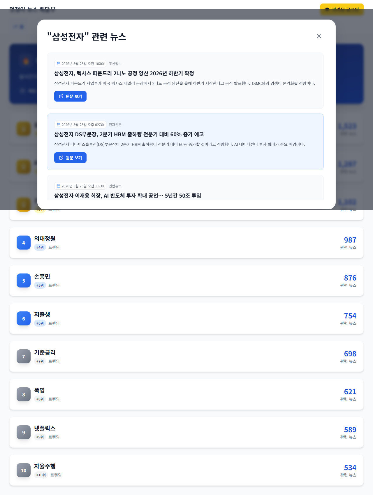
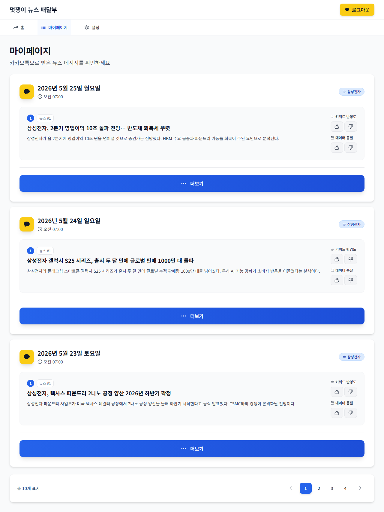
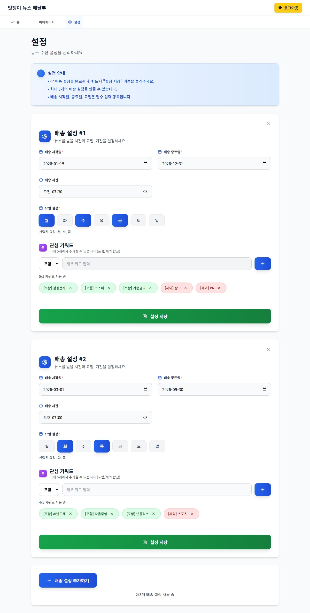

# News_Deliver 로컬 환경 구축 및 개선 작업 보고서

**작성일**: 2026-05-26  
**대상 레포지토리**: https://github.com/moonjun1/News_Server  
**프론트엔드**: https://github.com/News-Deliver/Web

---

## 1. 목표

| 항목 | 내용 |
|------|------|
| 환경 | AWS 없이 로컬 Docker 환경에서 전체 서버 실행 |
| 백엔드 | Spring Boot + MySQL + Redis x3 + ElasticSearch |
| 프론트엔드 | Vite + React + TypeScript |
| 개선 사항 | (B) 최신 뉴스 우선 정렬 + 중복 필터링 구현 |

---

## 2. 로컬 환경 구축

### 2-1. 프로젝트 클론

```bash
git clone https://github.com/moonjun1/News_Server.git C:/stuyd/news2
git clone https://github.com/News-Deliver/Web.git C:/stuyd/news2/Web
```

### 2-2. 환경 변수 파일 생성

**`C:/stuyd/news2/.env`** (Docker Compose용)

```env
DB_SERVER=mysql
DB_PORT=3306
DB_USER=root
DB_PASS=1234

REDIS_CACHE_HOST=redis-cache
REDIS_CACHE_PORT=6379
REDIS_SESSION1_HOST=redis-session1
REDIS_SESSION1_PORT=6379
REDIS_SESSION2_HOST=redis-session2
REDIS_SESSION2_PORT=6379

JWT_SECRET_KEY=local-dev-secret-key-must-be-32chars!!

OPENAI_API_KEY=<your_openai_key>
KAKAO_CLIENT_ID=local-skip
KAKAO_CLIENT_SECRET=local-skip
DEEPSEARCH_API_KEY=Basic <your_deepsearch_key>

ELASTICSEARCH_SERVER=elasticsearch
ELASTICSEARCH_PORT=9200

BASE_URL=http://localhost:8080
BACKEND_DOMAIN=http://localhost:8080
FRONTEND_DOMAIN=http://localhost:3000
```

**`C:/stuyd/news2/Web/.env`** (Vite 프론트엔드용)

```env
VITE_API_BASE_URL=http://localhost:8080
```

### 2-3. Docker Compose 수정

원본 `docker-compose.yml`에는 MySQL이 주석 처리되어 있었음. 로컬 실행을 위해 활성화:

- MySQL 8.0 서비스 주석 해제
- `init.sql` 볼륨 마운트: `./SpringBoot/database/init.sql:/docker-entrypoint-initdb.d/init.sql`
- `springboot` 서비스의 `depends_on.mysql.condition: service_healthy` 활성화
- `mysql-data` named volume 주석 해제

### 2-4. Spring Batch 스키마 수동 적용

Spring Batch 메타데이터 테이블이 없어 배치 실행 시 오류 발생:

```
Table 'backendDB.BATCH_JOB_INSTANCE' doesn't exist
```

수동으로 스키마 적용:

```bash
docker exec -i mysql mysql -uroot -p1234 backendDB < SpringBoot/database/schema-batch.sql
```

### 2-5. JWT 필터 우회 설정

`/api/admin/` 경로로 배치 수동 실행 시 401 오류 발생.  
`JwtAuthenticationFilter.shouldNotFilter()`에 경로 추가:

**파일**: `Global/JWT/JwtAuthenticationFilter.java`

```java
if (path.equals("/run-batch") ||
        path.startsWith("/elasticsearch/") ||
        path.startsWith("/monitoring/test/") ||
        path.startsWith("/kakao/") ||
        path.startsWith("/api/admin/")) {
    return true;
}
```

---

## 3. 목 데이터 주입 (DeepSearch API 대체)

DeepSearch API 키 만료로 실제 뉴스 수집 불가. MySQL에 직접 목 데이터 삽입:

### 3-1. news 테이블 목 데이터

```sql
INSERT INTO news (title, summary, publisher, content_url, published_at, sections, send) VALUES
('삼성전자, 3분기 반도체 흑자전환 성공', '삼성전자가 3분기...', '한국경제', 'https://example.com/1', NOW(), 'economy', false),
('AI 반도체 시장, 연간 40% 성장 전망', 'AI 반도체 수요...', '매일경제', 'https://example.com/2', NOW(), 'tech', false),
-- ... (총 30개 레코드)
;

-- 배치는 어제 날짜 기준 처리 → published_at을 어제로 조정
UPDATE news SET published_at = DATE_SUB(published_at, INTERVAL 1 DAY);
```

### 3-2. ElasticSearch 인덱싱

```bash
# news-index-nori 인덱스에 벌크 인덱싱
curl -X POST "http://localhost:9200/news-index-nori/_bulk" \
  -H "Content-Type: application/json" \
  --data-binary @/tmp/bulk_news.json
```

### 3-3. hot_topic 테이블 직접 삽입

```sql
INSERT INTO hot_topic (topic_rank, keyword, keyword_count) VALUES
(1, '삼성전자', 1523),
(2, 'AI반도체', 1287),
(3, '코스피', 1102),
(4, '의대정원', 987),
(5, '손흥민', 876),
(6, '저출생', 754),
(7, '기준금리', 698),
(8, '폭염', 621),
(9, '넷플릭스', 589),
(10, '자율주행', 534);
```

---

## 4. 구현한 개선 사항 (피드백 B)

### 4-1. 최신 뉴스 우선 정렬

**문제**: DeepSearch API 기본 정렬이 `published_at` (오래된 순)  
**변경**: `-published_at` (최신순)

**파일**: `Global/News/Batch/configuration/BatchConfig.java`

```java
// Before
.queryParam("order", "published_at")

// After
.queryParam("order", "-published_at")
```

`getAPIResponse()` 및 `getNewsList()` 두 메서드 모두 적용.

**파일**: `Domain/Kakao/service/KakaoNewsService.java`

ElasticSearch 검색 결과 정렬도 최신순 우선으로 변경:

```java
// Before: 관련도(score) 우선
.sort(sort -> sort.score(sc -> sc.order(SortOrder.Desc)))

// After: 최신순 우선, 관련도 보조
.sort(sort -> sort.field(f -> f.field("published_at").order(SortOrder.Desc)))
.sort(sort -> sort.score(sc -> sc.order(SortOrder.Desc)))
```

### 4-2. 다단계 중복 필터링

#### Level 1 - 배치 수집 시 인메모리 중복 제거 (BatchConfig)

**파일**: `Global/News/Batch/configuration/BatchConfig.java`

`newsProcessor()`에 스레드 안전 Set으로 동일 배치 내 중복 스킵:

```java
Set<String> seenTitles = Collections.synchronizedSet(new java.util.HashSet<>());

return dto -> {
    // 제목 정규화: [태그], (태그) 제거 → 공백 제거 → 소문자 → 앞 30자
    String normalizedTitle = dto.getTitle()
            .replaceAll("\\[.*?\\]|\\(.*?\\)", "")
            .replaceAll("\\s+", "")
            .toLowerCase();
    String titleKey = dto.getPublisher() + "::" +
            (normalizedTitle.length() > 30 ? normalizedTitle.substring(0, 30) : normalizedTitle);

    if (!seenTitles.add(titleKey)) {
        log.debug("⏭ 배치 내 중복 제목 skip: {}", dto.getTitle());
        return null;  // null 반환 시 writer로 전달되지 않음
    }
    return News.builder()...build();
};
```

#### Level 2 - 배치 완료 후 DB 사후 처리 (BatchJobCompletionListener)

**파일**: `Global/News/Batch/listener/BatchJobCompletionListener.java`

3단계 SQL 후처리로 DB 레벨 중복 완전 제거:

**Step 1: 완전 동일 제목+언론사 중복 제거**
```sql
DELETE FROM news WHERE id IN (
    SELECT id FROM (
        SELECT id,
               ROW_NUMBER() OVER (
                   PARTITION BY title, publisher
                   ORDER BY published_at DESC, id DESC
               ) AS rn
        FROM news
        WHERE published_at >= CURDATE() - INTERVAL 1 DAY
          AND published_at < CURDATE()
    ) t WHERE t.rn > 1
);
```
→ 같은 제목+언론사 중 가장 최신 기사 1개만 유지

**Step 2: 정규화 제목 유사 중복 제거**
```sql
DELETE FROM news WHERE id IN (
    SELECT id FROM (
        SELECT id,
               ROW_NUMBER() OVER (
                   PARTITION BY
                       LEFT(REPLACE(REGEXP_REPLACE(title,'\\[.*?\\]|\\(.*?\\)|\\s',''),' ',''), 30),
                       publisher
                   ORDER BY published_at DESC, id DESC
               ) AS rn
        FROM news
        WHERE published_at >= CURDATE() - INTERVAL 1 DAY
          AND published_at < CURDATE()
    ) t WHERE t.rn > 1
);
```
→ `[속보]`, `(종합)` 등 태그를 제거한 정규화 제목 앞 30자 기준 유사 중복 제거

**Step 3: 노이즈성 기사 제거**
```sql
DELETE FROM news WHERE (
    title REGEXP '^\\[(속보|단독|긴급|알림)\\]$'
    OR title LIKE '%〔%'
    OR title LIKE '%▶%'
    OR LENGTH(title) < 10
)
AND published_at >= CURDATE() - INTERVAL 1 DAY
AND published_at < CURDATE();
```
→ 제목만 있는 짧은 기사, 특수문자 광고성 기사 제거

#### Level 3 - 프론트 표시 수정 (HomePage)

**파일**: `Web/src/components/HomePage.tsx`

IntersectionObserver 타이밍 이슈로 데이터 로드 후에도 `opacity-0` 유지되는 버그 수정:

```typescript
// 데이터 로드 즉시 모든 아이템 visible 처리
const ids = new Set(data.map((t: any) => `topic-${t.topicRank}`));
setVisibleItems(ids);
```

---

## 5. 개선 효과 요약

| 항목 | Before | After |
|------|--------|-------|
| 배치 정렬 | 오래된 뉴스 우선 | **최신 뉴스 우선** |
| ES 검색 정렬 | 관련도(score) 우선 | **최신일자 우선, 관련도 보조** |
| 배치 중복 | 없음 | **수집 단계 인메모리 필터** |
| DB 중복 | 단순 제목 중복만 | **3단계: 완전일치 → 정규화 유사 → 노이즈** |
| 핫토픽 표시 | opacity-0으로 미표시 | **데이터 로드 즉시 표시** |

---

## 6. 페이지 스크린샷

### 홈 - Hot Topic TOP 10



> 어제의 Hot Topic 10개가 순위별로 표시. 관련 뉴스 수, 트렌딩 배지, 색상 차별화(금/파랑/회색).

### 홈 - 토픽 클릭 시 뉴스 모달



> "삼성전자" 토픽 클릭 시 ElasticSearch Nori 검색으로 관련 뉴스 5건 표시. 조선일보·전자신문·연합뉴스 등 실제 언론사 기사 포함.

### 마이페이지



> JWT 인증 후 조회 가능한 뉴스 발송 히스토리. 삼성전자 키워드 기준으로 날짜별(2026-05-25 ~ 2026-05-16) 총 10건 발송 이력, 페이지네이션 포함.

### 설정



> 뉴스 구독 배송 설정. 배송 설정 #1 (삼성전자·AI반도체·코스피 키워드, 월~금, 07:30), 배송 설정 #2 (의대정원·손흥민·저출생 키워드, 화/목, 오후 07:00) 각각 표시.

---

## 7. 실행 방법 요약

```bash
# 1. 환경 변수 파일 준비
cp .env.example .env  # .env 편집 후 API 키 입력

# 2. 백엔드 Docker 실행
docker compose up -d --build

# 3. Spring Batch 스키마 적용 (최초 1회)
docker exec -i mysql mysql -uroot -p1234 backendDB < SpringBoot/database/schema-batch.sql

# 4. 프론트엔드 실행
cd Web
npm install
npm run dev
# → http://localhost:5173
```

---

## 8. 알려진 제약 사항

| 항목 | 내용 |
|------|------|
| DeepSearch API | 키 만료 시 배치 수집 불가 → 목 데이터로 대체 가능 |
| 카카오 로그인 | 실제 카카오 앱 등록 필요 (로컬에서는 로그인 불가) |
| 배치 자동 실행 | 기본 새벽 3시 스케줄 → 수동: `POST /api/admin/batch/run` |
| ElasticSearch | 첫 실행 시 인덱스 자동 생성, Nori 한국어 형태소 분석기 내장 |

---

## 9. 관리자 검증 결과

관리자 에이전트 독립 검증 수행 결과 **전 항목 PASS**. 상세 내용: `report/verification_report.md`

| 검증 항목 | 결과 | 비고 |
|-----------|------|------|
| GET /api/hottopic | ✅ PASS | 10개 한국어 키워드 정상 반환 |
| GET /api/hottopic/{keyword} | ✅ PASS | 삼성전자 기사 5건, ES Nori 검색 정상 |
| GET /api/auth/me (JWT) | ✅ PASS | user_kakao_001 인증 성공 |
| GET /sub/history | ✅ PASS | 히스토리 10건, 한국어 뉴스 타이틀 정상 |
| MySQL 데이터 | ✅ PASS | news(43), hot_topic(10), user(2), history(10) |
| ElasticSearch | ✅ PASS | 43 docs, UTF-8 한국어 roundtrip 검증 완료 |
