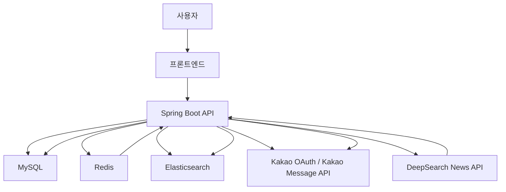
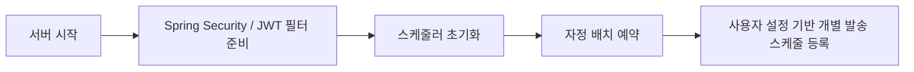
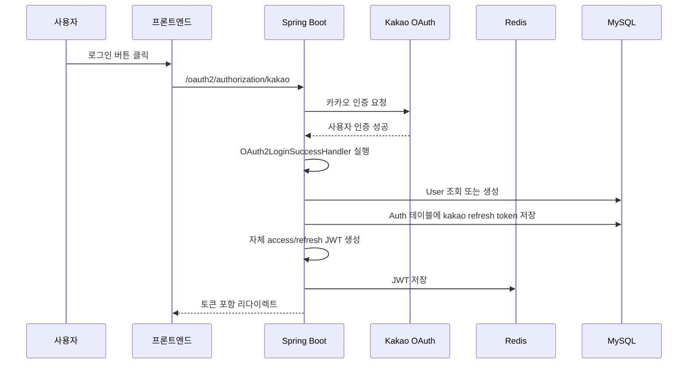
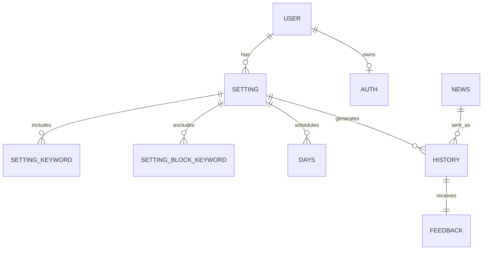
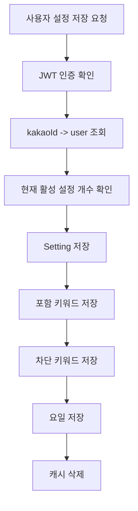
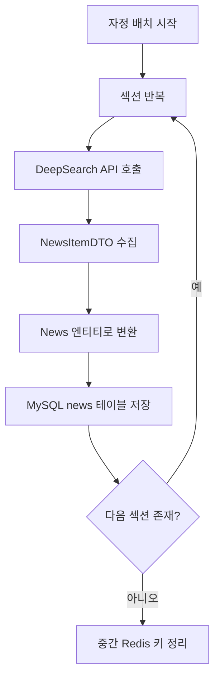
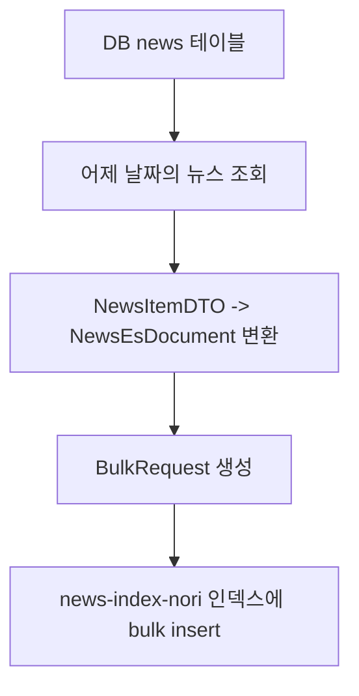
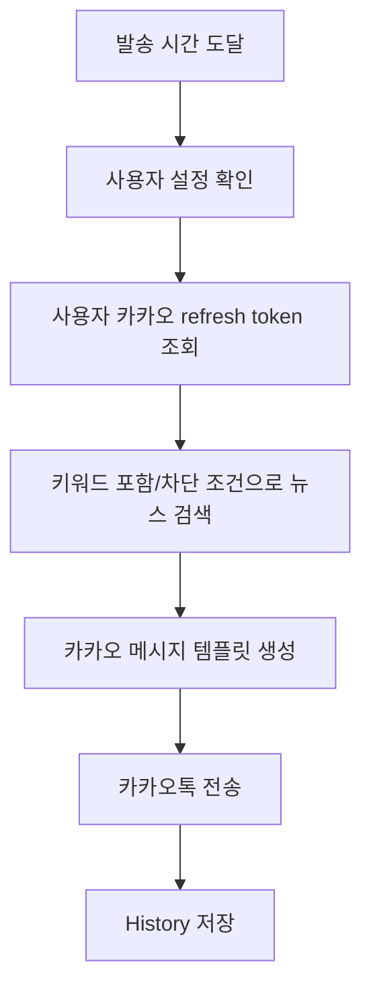
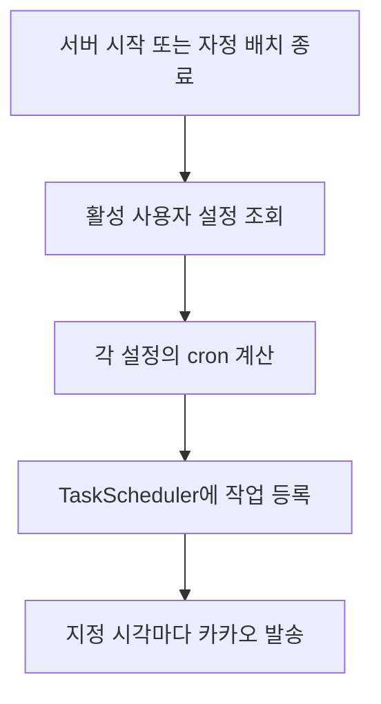
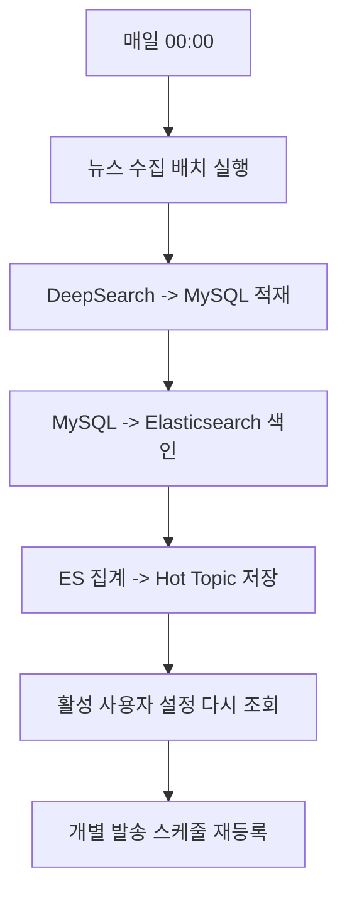

# News_Server 전체 로직 정리

## 1. 프로젝트 한 줄 설명

이 프로젝트는 사용자가 카카오 로그인으로 가입한 뒤, 자신이 설정한 관심 키워드와 수신 요일/시간에 맞춰 맞춤형 뉴스를 카카오톡으로 전달받는 뉴스 배달 서비스이다.  
추가로, 전날 수집된 전체 뉴스 데이터를 Elasticsearch에 색인하여 "어제의 인기 키워드 Top 10"을 제공하고, 특정 키워드와 관련된 뉴스를 다시 검색하는 기능도 포함한다.

---

## 2. 전체 기술 스택

- Backend: Spring Boot 3.5.3, Java 17
- Security: Spring Security, OAuth2 Client, JWT
- Database: MySQL
- Cache / Token Storage: Redis
- Search / Aggregation: Elasticsearch 8.13
- Batch: Spring Batch
- Scheduler: Spring TaskScheduler, Spring Scheduling
- External API:
  - Kakao OAuth2 / Kakao Message API
  - DeepSearch News API
- API Docs: Swagger / springdoc-openapi

---

## 3. 서비스가 하는 일

이 서비스는 크게 6개의 큰 흐름으로 나눌 수 있다.

1. 사용자가 카카오 로그인으로 가입한다.
2. 서비스가 자체 JWT 토큰을 발급해 인증 상태를 유지한다.
3. 사용자가 뉴스 수신 설정을 저장한다.
4. 매일 자정 배치가 전날 뉴스 데이터를 수집하고 DB와 Elasticsearch를 갱신한다.
5. 핫토픽을 계산하고 사용자별 발송 스케줄을 등록한다.
6. 정해진 시간에 카카오톡으로 맞춤형 뉴스를 보낸다.

---

## 4. 전체 구조 다이어그램

---

## 5. 패키지 기준 주요 역할

### 5-1. `Domain/Auth`

- 사용자 엔티티, 인증 엔티티, 토큰 갱신, 로그아웃, 사용자 조회 담당
- 카카오 로그인 이후 서비스 자체 JWT를 발급하고 Redis에 저장

### 5-2. `Global/OAuth2`, `Global/JWT`

- OAuth2 로그인 성공 처리
- JWT 생성, 검증, 필터 처리
- Spring Security 인증 체인 구성

### 5-3. `Domain/Mypage`

- 사용자 뉴스 설정 CRUD 담당
- 뉴스 수신 시간, 시작/종료일, 키워드, 차단 키워드, 요일 관리

### 5-4. `Global/News/Batch`

- DeepSearch API에서 섹션별 뉴스를 가져와 DB에 적재
- Spring Batch 기반 수집 파이프라인 담당

### 5-5. `Global/News/ElasticSearch`

- DB에 저장된 뉴스를 Elasticsearch에 색인
- 키워드 검색 및 집계 담당

### 5-6. `Domain/HotTopic`

- 어제 뉴스 기준 인기 키워드 Top 10 계산
- 핫토픽 목록 반환
- 특정 키워드 관련 뉴스 검색

### 5-7. `Domain/Kakao`

- 카카오 메시지 발송
- 사용자별 스케줄 표현식 생성
- 발송 이력 관리

### 5-8. `Domain/SubServices`

- 더보기 뉴스 검색
- 발송 히스토리 조회
- 피드백 저장

---

## 6. 실행 시점 기준 큰 흐름

서버가 실행되면 단순히 API만 준비하는 것이 아니라, 스케줄링도 함께 준비한다.  
즉 이 프로젝트는 요청-응답형 서버이면서 동시에 "배치 시스템"과 "예약 발송 시스템" 성격도 가진다.

---

## 7. 인증 로직 전체 설명

인증은 `카카오 로그인 + 서비스 자체 JWT`의 2단 구조다.

### 7-1. 왜 2단 구조를 쓰는가

- 카카오 로그인은 최초 사용자 신원 확인용
- 이후 서비스 내부 API 인증은 서비스 JWT로 처리
- 이렇게 하면 프론트엔드와 백엔드가 카카오 액세스 토큰에 직접 종속되지 않고, 자체 인증 정책을 가질 수 있다

### 7-2. 인증 흐름 요약

### 7-3. 세부 동작

1. 사용자가 카카오 로그인 요청을 시작한다.
2. Spring Security의 OAuth2 로그인 플로우가 작동한다.
3. 로그인 성공 후 `OAuth2LoginSuccessHandler`가 실행된다.
4. 카카오 사용자 정보에서 `kakaoId`를 꺼낸다.
5. `OAuth2AuthorizedClientService`를 통해 카카오 refresh token을 추출한다.
6. `User` 테이블에서 해당 사용자가 있는지 확인한다.
7. 없으면 신규 유저를 생성한다.
8. `Auth` 테이블에 카카오 refresh token을 저장하거나 갱신한다.
9. 서비스 자체 access token, refresh token을 JWT로 새로 만든다.
10. Redis에 access token과 refresh token을 저장한다.
11. 프론트엔드로 토큰 정보를 쿼리스트링에 실어 리다이렉트한다.

### 7-4. JWT 인증 로직

- 클라이언트는 이후 API 호출 때 Bearer 토큰을 보낸다.
- `JwtAuthenticationFilter`가 매 요청마다 JWT를 검사한다.
- 토큰이 유효하면 Spring Security의 Authentication 객체를 만든다.
- 이후 컨트롤러는 `authentication.getName()`으로 `kakaoId`를 얻는다.

### 7-5. 토큰 갱신

토큰 갱신 API는 `/api/auth/refresh` 이다.

동작 순서:

1. 클라이언트가 refresh token을 보낸다.
2. JWT 서명과 만료를 검증한다.
3. 토큰에서 `kakaoId`를 추출한다.
4. Redis에 저장된 refresh token과 비교한다.
5. 둘이 일치하면 새 access/refresh token을 발급한다.
6. Redis에 다시 저장한다.
7. 새 토큰을 응답한다.

이 구조는 단순 JWT만 쓰는 것보다 안전하다.  
이유는 토큰이 서명상 유효하더라도 Redis 저장값과 다르면 무효 처리할 수 있기 때문이다.

### 7-6. 로그아웃

- 로그아웃 시 Redis에서 access token과 refresh token을 삭제한다.
- 이후 같은 토큰을 보내더라도 Redis 검증에서 걸러진다.

---

## 8. SecurityConfig 설명

`SecurityConfig`는 이 프로젝트의 API 공개 범위를 결정하는 핵심 설정이다.

### 공개 허용 API

- `/`
- `/redirect`
- `/api/auth/status`
- `/login/oauth2/**`
- `/oauth2/**`
- Swagger 관련 경로
- `/api/hottopic/**`
- 일부 테스트/관리용 API

### 인증 필요 API

- `/api/auth/logout`
- `/api/auth/me`
- `/api/setting/**`
- `/sub/**`
- 나머지 대부분의 API

### CORS

- localhost 개발 주소
- `likelionnews.click`
- amplifyapp 도메인
- netlify 주소
- 특정 EC2 IP

즉 프론트엔드가 여러 배포 환경에서 접근할 수 있도록 미리 허용해둔 상태다.

---

## 9. DB 테이블 구조와 의미

### 핵심 테이블 설명

- `user`
  - 카카오 로그인 사용자의 내부 계정
- `auth`
  - 카카오 refresh token 저장
- `setting`
  - 사용자 뉴스 수신 설정
- `setting_keyword`
  - 받고 싶은 키워드
- `setting_block_keyword`
  - 제외하고 싶은 키워드
- `days`
  - 발송 요일
- `news`
  - 수집된 뉴스 원본 저장
- `history`
  - 어떤 설정으로 어떤 뉴스가 언제 발송됐는지 저장
- `feedback`
  - 사용자가 남긴 피드백
- `hot_topic`
  - 어제의 인기 키워드 저장

이 프로젝트는 단순 뉴스 조회 앱이 아니라,  
"수집된 뉴스 데이터"와 "사용자 설정"과 "발송 이력"을 연결해 개인화 추천 흐름을 만드는 구조다.

---

## 10. 사용자 설정 로직

사용자 설정은 이 서비스의 개인화 핵심이다.

### 10-1. 저장 가능한 정보

- 뉴스 받을 시간 `deliveryTime`
- 수신 시작일 `startDate`
- 수신 종료일 `endDate`
- 포함 키워드 목록
- 차단 키워드 목록
- 수신 요일 목록

### 10-2. 저장 흐름

### 10-3. 중요한 포인트

- 컨트롤러에서 `authentication.getName()`으로 현재 사용자 확인
- `AuthService.findByKakaoId()`로 내부 `userId`를 찾음
- 설정 개수 제한이 있음
- 설정 저장 전에 `Setting` 엔티티를 먼저 저장하고, 그 후 자식 데이터를 저장
- 수정 시 기존 키워드/차단 키워드/요일을 지우고 다시 저장
- 삭제는 하드 삭제가 아니라 soft delete 형태
- 설정 조회 결과는 Redis 캐시를 사용

### 10-4. 왜 캐시를 쓰는가

설정은 자주 조회되지만 자주 바뀌지는 않기 때문에,  
`userSettingCache`에 저장해 두면 스케줄러와 API 조회 성능이 좋아진다.

---

## 11. 뉴스 수집 배치 로직

이 프로젝트에서 가장 중요한 백엔드 흐름 중 하나가 배치 수집이다.

### 11-1. 수집 대상

DeepSearch API에서 다음 섹션별 뉴스를 가져온다.

- politics
- economy
- society
- culture
- tech
- entertainment
- opinion

### 11-2. 배치 흐름

### 11-3. 구체적인 동작

1. `BatchSchedulerService`가 자정 cron으로 배치 작업을 예약한다.
2. `BatchService.runBatch()`가 섹션 배열을 순회한다.
3. 각 섹션마다 Spring Batch Job 실행 파라미터를 만든다.
4. `BatchConfig.apiReader()`가 전날 날짜를 계산한다.
5. DeepSearch API를 페이지 단위로 호출한다.
6. 응답을 `NewsItemDTO` 리스트로 모은다.
7. Processor가 DTO를 `News` 엔티티로 바꾼다.
8. Writer가 `news` 테이블에 대량 insert 한다.
9. 섹션별 처리가 모두 끝나면 중간 Redis 카운트를 정리한다.

### 11-4. 왜 Spring Batch를 썼는가

- 대량 데이터 처리에 적합
- Reader / Processor / Writer 분리 가능
- Job / Step 단위 실행 이력 관리 가능
- 에러 추적과 반복 실행에 유리

### 11-5. 모니터링용 배치

`NewsMonitoringConfig`는 당일 데이터 수집/모니터링 성격의 별도 배치 흐름이다.  
즉 운영성 확인과 테스트 목적 성격이 섞여 있는 것으로 보인다.

---

## 12. Elasticsearch 색인 로직

배치로 DB에 저장된 뉴스는 바로 검색 가능한 상태가 되는 것이 아니다.  
검색 성능과 키워드 집계를 위해 Elasticsearch에 다시 색인한다.

### 12-1. 색인 흐름

### 12-2. 이 서비스가 하는 일

- 전날 기사만 가져온다
- 섹션별로 조회한다
- `NewsEsDocument`로 변환한다
- Elasticsearch에 bulk 색인한다
- 실패 건이 있으면 로그에 남긴다

### 12-3. 왜 ES가 필요한가

MySQL만으로도 조회는 가능하지만 다음 기능이 어렵거나 느려진다.

- 키워드 기반 유사 기사 검색
- 형태소 기반 검색
- 점수 기반 정렬
- terms aggregation으로 인기 키워드 집계

그래서 뉴스 검색과 핫토픽 계산은 MySQL이 아니라 Elasticsearch가 담당한다.

---

## 13. 핫토픽 로직

핫토픽은 "어제 뉴스에서 가장 많이 등장한 키워드"를 의미한다.

### 13-1. 계산 방식

1. Elasticsearch에서 어제 날짜 범위의 문서만 본다.
2. `combinedTokens` 필드에 대해 terms aggregation을 수행한다.
3. 상위 10개 키워드를 가져온다.
4. 순위를 매겨 `hot_topic` 테이블에 저장한다.

### 13-2. 조회 방식

- `/api/hottopic` 호출 시 어제 날짜의 Top 10을 DB에서 가져온다.
- 결과는 Redis에 `hottopic:daily` 키로 캐시한다.
- 캐시 TTL은 다음 자정까지 유지한다.

### 13-3. 특정 키워드 관련 뉴스 조회

- `/api/hottopic/{keyword}`
- Redis 캐시에 키워드별 검색 결과를 저장
- 없으면 Elasticsearch에서 검색
- 상위 20건 반환

### 13-4. 왜 DB에도 저장하는가

실시간 aggregation 결과만 쓰면 매번 ES에 부하가 걸린다.  
또 어제의 공식 핫토픽 결과를 고정된 형태로 보관하기 위해 DB 저장이 필요하다.

---

## 14. 카카오 메시지 발송 로직

이 서비스의 최종 목표는 검색이 아니라 발송이다.

### 14-1. 발송 흐름 개요

### 14-2. `KakaoController.sendMessage()`

이 API는 전체 사용자에게 메시지를 보내는 관리/테스트성 엔드포인트 역할을 한다.

동작 순서:

1. `Auth` 테이블에서 모든 사용자의 카카오 refresh token을 조회
2. 각 토큰으로 사용자별 메시지 발송 시도
3. 실패한 토큰은 1차 실패 목록에 저장
4. 실패 토큰만 다시 한번 재시도
5. 끝까지 실패하면 에러 처리

즉 기본적으로 "전체 사용자 일괄 발송 + 1회 재시도" 구조다.

### 14-3. 사용자별로 어떤 뉴스가 가는가

실제 발송 뉴스는 `KakaoNewsService`가 검색한다.

검색 조건:

- 포함 키워드와 매칭되는 뉴스
- 차단 키워드는 제외
- 우선 어제 기사 기준 검색
- 결과가 5개 미만이면 최근 7일로 fallback
- 점수 기준 내림차순 정렬
- 최대 5건 반환

### 14-4. 왜 fallback이 필요한가

사용자가 너무 좁은 키워드를 넣으면 어제 기사만으로는 결과가 부족할 수 있다.  
그래서 최근 7일로 범위를 넓혀 최소한 보낼 기사 수를 확보한다.

---

## 15. 사용자별 발송 스케줄 로직

이 서비스는 단순 고정 시각 발송이 아니라 사용자별 설정 기반 발송을 지원한다.

### 15-1. Cron 생성

`KakaoSchedulerService`는 `Setting` 객체에서 다음 정보를 읽는다.

- `deliveryTime`
- `days`

그리고 이것을 cron 표현식으로 바꾼다.

예시:

- 월, 수, 금 오전 9시 30분
- `0 30 9 ? * MON,WED,FRI`

### 15-2. 초기화 흐름

즉 이 시스템은 매일 자정에 뉴스 데이터만 갱신하는 것이 아니라,  
그날 기준으로 유효한 사용자 설정들을 읽어 발송 스케줄도 다시 구성한다.

---

## 16. 더보기 뉴스 로직

사용자가 받은 뉴스 외에 추가 기사도 보고 싶을 수 있다.  
이 기능이 `MoreNewsService`다.

### 16-1. 입력값

- `historyId`

즉 과거에 실제로 발송된 한 건의 히스토리를 기준으로 관련 뉴스를 더 찾는다.

### 16-2. 동작 방식

1. `history` 테이블에서 해당 발송 이력을 찾는다.
2. 그 이력에 기록된 포함 키워드와 차단 키워드를 읽는다.
3. 문자열을 리스트로 분리한다.
4. Elasticsearch에 multi-match 쿼리를 만든다.
5. 포함 키워드는 `should`
6. 차단 키워드는 `mustNot`
7. 발송 시점 기준으로 날짜 하한선도 적용한다.
8. 최대 15개의 뉴스 문서를 반환한다.
9. 결과는 Redis 캐시에 저장한다.

### 16-3. 왜 history 기준인가

사용자의 현재 설정이 바뀌더라도,  
"그 당시 어떤 조건으로 이 뉴스가 발송되었는지"를 기준으로 관련 기사를 보여주기 위함이다.

이 방식은 회고성과 재현성이 높다.

---

## 17. 히스토리 로직

히스토리는 이 서비스에서 매우 중요하다.

### 히스토리가 필요한 이유

- 어떤 뉴스가 실제로 발송되었는지 추적 가능
- 중복 발송 관리에 활용 가능
- 사용자 피드백과 연결 가능
- "더보기" 기능의 기준점 역할 가능

### 저장 정보

- 발송 시각
- 어떤 설정으로 보냈는지
- 어떤 뉴스였는지
- 당시 포함 키워드
- 당시 차단 키워드

즉 단순 로그가 아니라 "발송 결과의 스냅샷"이다.

---

## 18. 피드백 로직

`feedback` 테이블은 `history`와 1:1 관계로 연결된다.

저장 가능한 값:

- keyword_reflection
- content_quality

즉 사용자는 특정 발송 결과에 대해

- 키워드가 얼마나 잘 반영됐는지
- 콘텐츠 품질이 어땠는지

를 점수로 남길 수 있다.

이 구조는 이후 추천 개선이나 품질 평가 지표로 확장하기 좋다.

---

## 19. 캐시 전략 정리

이 프로젝트는 Redis를 단순 세션 저장소로만 쓰지 않는다.

### 사용되는 캐시 종류

- JWT access token 저장
- JWT refresh token 저장
- 사용자 설정 조회 캐시
- 핫토픽 일일 캐시
- 키워드별 뉴스 검색 결과 캐시
- 더보기 뉴스 캐시
- 배치 중간 상태 카운트

### 캐시의 목적

- 인증 성능 향상
- 토큰 무효화 가능
- 반복 조회 비용 절감
- 핫토픽 API 응답 속도 향상
- ES 반복 질의 감소
- 배치 상태 추적

즉 Redis는 이 프로젝트에서 "속도"와 "상태 관리"를 동시에 담당한다.

---

## 20. 자정 배치 전체 흐름

이 부분은 발표에서 가장 중요하게 설명할 수 있다.

이 흐름 하나만 이해하면 이 프로젝트의 핵심 운영 구조가 거의 다 보인다.

### 의미

- 자정에 새로운 하루 기준 데이터셋을 만든다
- 그 데이터를 검색 가능한 형태로 변환한다
- 그 데이터로 핫토픽을 계산한다
- 그날 유효한 사용자 설정을 기준으로 발송 예약을 다시 건다

즉 "데이터 준비"와 "발송 준비"가 자정에 함께 끝난다.

---

## 21. API를 기능별로 묶어서 보기

### 인증

- `POST /api/auth/refresh`
- `POST /api/auth/logout`
- `GET /api/auth/me`
- `GET /api/auth/status`

### 사용자 설정

- `GET /api/setting`
- `POST /api/setting`
- `PUT /api/setting`
- `DELETE /api/setting/{id}`

### 핫토픽

- `GET /api/hottopic`
- `GET /api/hottopic/{keyword}`

### 서브 기능

- `GET /sub/history/{historyId}` 더보기 뉴스
- `GET /sub/history` 내 히스토리 조회

### 배치/관리/테스트

- `GET /api/admin/batch`
- 기타 핫토픽/ES/모니터링 테스트 API

### 카카오

- `GET /kakao/send-message`
- `GET /kakao/search-news-test`

---

## 22. 발표 때 강조하면 좋은 설계 포인트

### 포인트 1. 로그인과 서비스 인증을 분리했다

카카오 로그인 자체는 외부 인증이지만,  
서비스 내부 인증은 JWT와 Redis 검증으로 독립 운영한다.

### 포인트 2. 수집과 검색을 분리했다

뉴스 원본은 MySQL에 저장하고,  
검색과 집계는 Elasticsearch가 담당한다.

### 포인트 3. 사용자 설정과 스케줄을 연결했다

단순 저장으로 끝나지 않고 실제 cron 발송과 연결된다.

### 포인트 4. 핫토픽은 단순 조회가 아니라 집계 결과다

어제 전체 뉴스에서 키워드 통계를 계산해 만든 결과다.

### 포인트 5. 히스토리 기반 확장성이 있다

더보기, 피드백, 품질 개선, 추천 튜닝으로 연결 가능하다.

---

## 23. 로직을 한 문장씩 외우기 쉽게 정리

- 로그인: 카카오로 사용자 인증을 받고, 우리 서비스 JWT를 새로 발급한다.
- 토큰 관리: JWT는 Redis와 함께 관리해서 검증과 무효화를 쉽게 한다.
- 설정 저장: 사용자의 키워드, 차단 키워드, 요일, 시간을 묶어서 개인화 규칙으로 저장한다.
- 뉴스 수집: 자정마다 DeepSearch API에서 전날 뉴스를 섹션별로 가져와 DB에 넣는다.
- 검색 준비: DB 뉴스는 Elasticsearch에 색인해 빠르게 검색할 수 있게 만든다.
- 핫토픽: Elasticsearch 집계로 어제 가장 많이 나온 키워드를 추출한다.
- 발송 예약: 사용자 설정을 cron으로 바꿔 발송 시간을 자동화한다.
- 뉴스 추천: 포함 키워드는 살리고 차단 키워드는 빼서 개인화된 뉴스를 찾는다.
- 더보기: 실제 발송 이력을 기준으로 비슷한 뉴스를 다시 Elasticsearch에서 검색한다.
- 피드백: 사용자의 평가를 저장해 서비스 품질 개선 기반을 만든다.

---

## 24. 보고서용 서술 예시

### 예시 1. 프로젝트 개요

본 프로젝트는 카카오톡을 기반으로 개인 맞춤형 뉴스를 정기적으로 전달하는 서비스이다. 사용자는 카카오 소셜 로그인을 통해 가입한 뒤, 자신이 원하는 뉴스 키워드, 차단 키워드, 수신 요일, 수신 시간을 설정할 수 있다. 시스템은 매일 자정 DeepSearch API를 통해 뉴스 데이터를 수집하고, 이를 MySQL과 Elasticsearch에 저장한 뒤, Elasticsearch 집계를 통해 인기 키워드를 계산한다. 이후 각 사용자의 설정에 맞춰 예약된 시각에 카카오톡 메시지로 뉴스를 발송한다.

### 예시 2. 인증 구조

인증 구조는 외부 인증과 내부 인증을 분리한 2단 구조로 설계하였다. 사용자는 카카오 OAuth2 로그인으로 최초 인증을 수행하며, 로그인 성공 이후 서버는 자체 JWT 액세스 토큰과 리프레시 토큰을 발급한다. 발급된 토큰은 Redis에 저장되어 검증 및 무효화에 활용되며, 이를 통해 로그아웃과 토큰 재발급 시나리오를 안정적으로 처리할 수 있다.

### 예시 3. 데이터 처리 구조

데이터 처리 구조는 수집, 저장, 검색, 집계의 역할을 명확히 분리하였다. 수집 단계에서는 DeepSearch API를 이용해 뉴스 데이터를 가져오고, 저장 단계에서는 MySQL에 원본 뉴스를 적재한다. 이후 검색 및 집계 단계에서는 Elasticsearch에 뉴스 데이터를 색인하여 키워드 기반 검색과 핫토픽 추출을 수행한다. 이러한 구조는 대량 뉴스 데이터 환경에서 성능과 확장성을 동시에 확보하는 데 유리하다.

---

## 25. 발표에서 예상 질문과 답변

### Q1. 왜 MySQL만 쓰지 않고 Elasticsearch를 같이 썼나요?

뉴스 검색과 핫토픽 집계는 단순 DB 조회보다 텍스트 검색과 집계 성능이 중요하기 때문이다. 그래서 원본 저장은 MySQL, 검색과 키워드 분석은 Elasticsearch로 역할을 분리했다.

### Q2. 왜 Redis가 필요한가요?

JWT 토큰 저장, 로그아웃 시 무효화, 설정 캐시, 핫토픽 캐시, 검색 캐시, 배치 상태 저장 등 빠른 조회와 상태 관리가 많이 필요하기 때문이다.

### Q3. 왜 배치를 자정에 돌리나요?

전날 뉴스 데이터를 기준으로 하루 단위의 정리된 데이터셋을 만들고, 그 결과를 바탕으로 핫토픽과 개인화 발송 준비를 마무리하기 위함이다.

### Q4. 사용자가 설정을 바꾸면 어떻게 되나요?

설정은 DB에 반영되고 관련 캐시가 삭제된다. 이후 스케줄 초기화 시점에 다시 반영되며, 현재 구조상 자정 기준 재등록 로직이 핵심이다.

### Q5. 더보기 기능은 어떤 기준으로 추천하나요?

현재 사용자의 최신 설정이 아니라, 실제 발송 당시 히스토리에 저장된 키워드와 차단 키워드를 기준으로 관련 뉴스를 다시 Elasticsearch에서 검색한다.

---

## 26. 아쉬운 점 또는 개선 가능 포인트

발표에서 솔직하게 말하면 오히려 설계 이해도가 높아 보일 수 있다.

- 일부 운영/관리 API가 공개되어 있어 보안 정책 강화가 필요하다.
- OAuth 성공 후 리다이렉트 URL이 하드코딩되어 있어 환경별 설정 분리가 더 필요하다.
- README에는 AI 요약 기능이 보이지만 실제 코드에서는 그 구현이 약하게 보인다.
- 설정 변경 직후 스케줄 재등록이 즉시 되는지 정책 점검이 필요하다.
- 테스트/운영용 코드가 일부 혼재되어 있어 역할 분리가 더 되면 좋다.

---

## 27. 최종 요약

이 프로젝트는 단순 뉴스 조회 서비스가 아니라,

- 외부 뉴스 데이터를 매일 수집하고
- 이를 검색 가능한 구조로 재가공하고
- 사용자별 설정을 반영해
- 카카오톡으로 정해진 시각에 개인화 뉴스를 발송하는

데이터 수집형 + 검색형 + 예약 발송형 백엔드 시스템이다.

핵심 키워드는 다음 5개로 요약할 수 있다.

- 개인화
- 자동화
- 검색 최적화
- 스케줄링
- 카카오 메시징

---

## 28. 발표 한 줄 결론

이 서비스는 "어제의 뉴스 데이터를 수집하고 분석한 뒤, 오늘 사용자에게 가장 맞는 뉴스를 카카오톡으로 자동 배달하는 시스템"이라고 설명하면 가장 이해가 빠르다.
